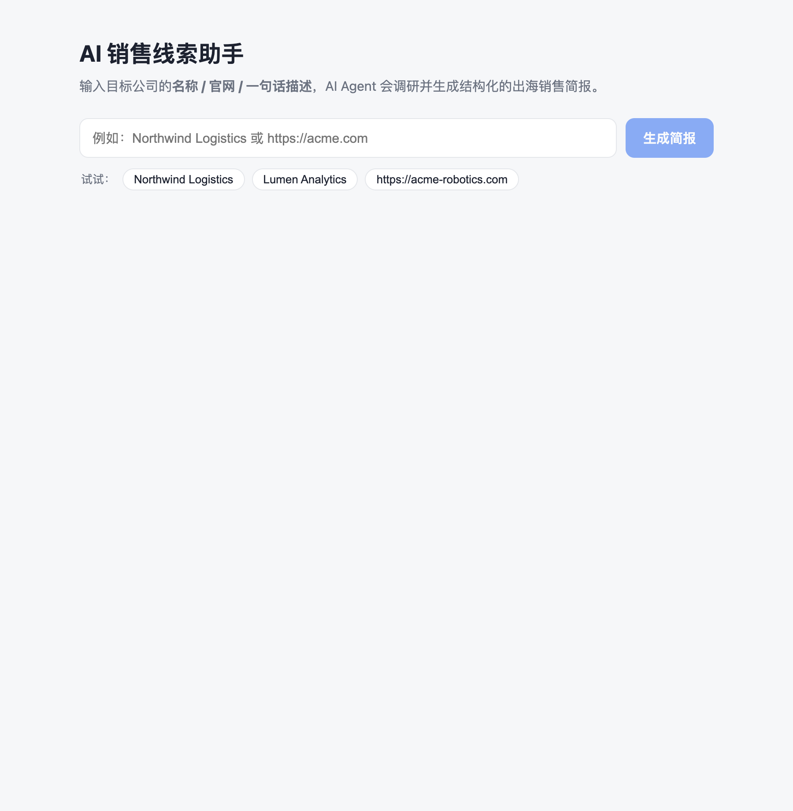
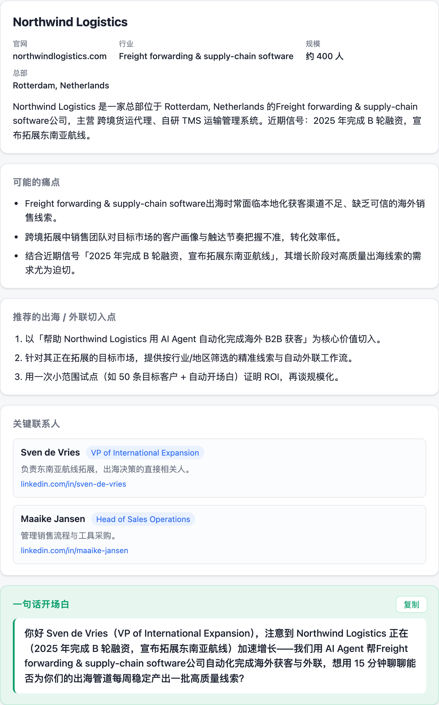

# Mini Lead Assistant · AI 销售线索助手

输入一个目标公司的**名称 / 官网 / 一句话描述**，后端的**带工具调用的 LLM Agent** 会调研该公司并产出结构化的「出海销售线索简报」，前端展示**简报**与 Agent 的**工具调用 / 思考轨迹**。

这是子午线（Meridian）全栈工程师 take-home 的实现。

---

## 它能做什么

- **输入**：公司名（`Northwind Logistics`）、网址（`https://acme-robotics.com`）或一句话描述。
- **LLM**：通义千问（Qwen，默认 `qwen-plus`），通过 DashScope 的 **OpenAI 兼容接口**调用；切换 provider 只需改 `services/llm.py` 一个文件。
- **Agent（多工具循环）**：由 LLM 自主编排两个工具 —— 先 `search_company` 收集事实，再 `find_decision_makers` 找关键决策人，然后据此推理。
- **结构化输出**：公司概况、可能的痛点、推荐的出海/外联切入点、一句话开场白（outreach opener）、关键联系人。
- **轨迹**：返回完整的 thinking / tool_call / tool_result / final 轨迹，前端以时间线展示。
- **零配置可运行**：未设置 `DASHSCOPE_API_KEY` 时自动走**确定性 stub**，全栈可在无密钥、无网络的情况下跑通。

---

## 界面预览

| 输入 | 结构化简报 |
| --- | --- |
|  |  |

---

## 快速开始

需要 Python 3.10+ 和 Node 18+。开两个终端。

### 1) 后端（FastAPI，默认 8000 端口）

```bash
cd backend
python3 -m venv .venv && source .venv/bin/activate
pip install -r requirements.txt

# 可选：使用真实 Qwen（通义千问）Agent。不设置则走 stub。
cp .env.example .env          # 然后在 .env 里填入 DASHSCOPE_API_KEY
# 或：export DASHSCOPE_API_KEY=sk-...   （可选 QWEN_MODEL，默认 qwen-plus）

uvicorn app.main:app --reload --port 8000
```

健康检查：`curl localhost:8000/api/health` → `{"status":"ok","version":"1.2.0","llm":"stub"}`（配置密钥后为 `"qwen"`）。

### 2) 前端（Vite + React，默认 5173 端口）

```bash
cd frontend
npm install
npm run dev
```

打开 http://localhost:5173 。前端通过 Vite 代理把 `/api` 转发到后端 `:8000`，无需额外配置 CORS。

### 直接调 API

```bash
curl -X POST localhost:8000/api/lead \
  -H 'Content-Type: application/json' \
  -d '{"input":"Northwind Logistics"}'
```

### 测试

后端带一组 hermetic 的 smoke 测试（走 stub 路径，无需密钥）：

```bash
cd backend && source .venv/bin/activate && pytest -q
```

覆盖：响应契约（字段齐全 + 关键联系人）、轨迹包含两个工具的完整 tool_call → tool_result 编排、空输入被拒（422）、两个工具的解析与确定性，以及用 **fake OpenAI 客户端**驱动真实 Qwen 工具调用循环（`_run_with_qwen`），无需联网即可覆盖 Agent 主逻辑。

---

## API

`POST /api/lead`

```jsonc
// 请求
{ "input": "Northwind Logistics" }

// 响应（节选）
{
  "company_overview": {
    "name": "Northwind Logistics",
    "website": "northwindlogistics.com",
    "industry": "Freight forwarding & supply-chain software",
    "size": "约 400 人",
    "headquarters": "Rotterdam, Netherlands",
    "summary": "..."
  },
  "pain_points": ["...", "..."],
  "outreach_angles": ["...", "..."],
  "outreach_opener": "你好 Sven de Vries（VP of International Expansion），注意到 Northwind Logistics 正在...",
  "key_contacts": [
    { "name": "Sven de Vries", "title": "VP of International Expansion", "linkedin": "...", "note": "..." }
  ],
  "used_stub": true,
  "trace": [
    { "type": "thinking",    "label": "模型推理", "detail": "..." },
    { "type": "tool_call",   "label": "调用工具 search_company", "data": { "query": "Northwind Logistics" } },
    { "type": "tool_result", "label": "search_company 返回结果", "data": { /* 公司事实 */ } },
    { "type": "tool_call",   "label": "调用工具 find_decision_makers", "data": { "company": "Northwind Logistics" } },
    { "type": "tool_result", "label": "find_decision_makers 返回结果", "data": { /* 联系人 */ } },
    { "type": "final",       "label": "生成结构化简报" }
  ]
}
```

---

## Agent 设计

核心在 `backend/app/services/agent.py`。这是一个**手写的 Agent 循环**（没有用 SDK 的 tool-runner），目的就是把每一步都记录进 `trace`，让评审能看清 Agent「怎么想、怎么调工具」。

分两个阶段：

1. **Gather（调研）** —— 带两个工具（OpenAI function 格式）循环调用 Qwen。返回 `tool_calls` 时按工具名分发执行（`EXECUTORS` 映射）、把结果以 `role:"tool"` 回灌，并把 thinking / tool_call / tool_result 写入轨迹；带最大轮数上限防止失控。新增工具只需在 `TOOLS` 加 schema、`EXECUTORS` 加一行，循环本身与具体工具解耦。
2. **Structure（结构化）** —— 最后一次调用使用 `response_format: {"type":"json_object"}`（JSON 模式），按提示词约定的字段产出 JSON，再用 Pydantic 模型（`LeadBrief` 等）校验，无需正则解析。

**工具**（`backend/app/services/tools.py`，均为 mock）：
- `search_company(query)` —— 返回公司事实（行业、规模、总部、产品、近期信号）。
- `find_decision_makers(company)` —— 返回关键决策人（姓名、职位、LinkedIn）；让 Agent 形成真正的多工具编排，也给销售「该联系谁」的产品价值。

内置几个典型出海客户画像（垂直 SaaS / 制造业 / DTC 电商），其余查询用基于哈希的**确定性生成**兜底，保证 Agent 永远有可推理的数据。按作业要求，数据真假不是重点，重点是工具调用的设计与全栈打通。

**模型**：默认 `qwen-plus`（可用 `QWEN_MODEL` 覆盖，如 `qwen-max`）。若使用支持思考的 Qwen 模型（qwen3 / qwq），其 `reasoning_content` 会作为 thinking 步写入轨迹。

---

## 设计取舍（4 小时约束下）

- **手写循环而非 tool-runner**：tool-runner 更省代码，但会把中间步骤藏起来。作业明确要看 Agent 轨迹，所以选择手写循环换取可观测性。
- **Stub 兜底**：没有密钥也能完整跑通全栈，评审零成本上手；`used_stub` 字段诚实地标注是哪条路径产出的结果。Stub 复用同一套工具与轨迹结构，不是另起一套假数据。
- **两阶段（gather → structure）**：把"调研"和"出结构化结果"分开，让结构化输出走 JSON 模式 + Pydantic 校验，省掉脆弱的字符串解析，前端拿到的一定是合法结构。
- **OpenAI 兼容接口接 Qwen**：用 `openai` SDK 指向 DashScope，复用成熟的 function-calling 协议；provider 切换集中在 `services/llm.py`，换 OpenAI / 其它兼容厂商只改一处。
- **内存即可、无数据库**：符合约束；Agent 无状态，每次请求独立。
- **Mock 工具数据**：把时间投在 Agent 循环、轨迹设计和前端联调上，而不是去接真实数据源。
- **产品 sense**：一句话开场白单独高亮、一键复制，并自然点名关键决策人；「关键联系人」卡片直接回答销售「该联系谁」。

---

## 项目结构

```
backend/
  app/
    main.py              # 应用工厂：create_app() + CORS + 挂载路由
    config.py            # 设置/常量（MODEL、MAX_TOKENS、密钥读取）
    schemas.py           # Pydantic 模型（请求 / 简报 / 轨迹）
    routers/
      lead.py            # APIRouter：POST /api/lead, GET /api/health, 错误处理
    services/
      agent.py           # Agent 循环（真实 Claude）+ stub；工具分发；结构化输出 schema
      tools.py           # search_company + find_decision_makers 工具 + mock 数据
      llm.py             # provider seam：有无密钥决定走真实 / stub
  tests/test_lead.py     # smoke 测试（走 stub，无需密钥）
  requirements.txt
  .env.example
frontend/
  src/
    main.jsx                 # 入口
    App.jsx                  # 输入 + loading/error/result 状态
    index.css
    api/client.js            # POST /api/lead
    components/BriefView.jsx # 简报卡片（开场白高亮 + 复制）
    components/TraceView.jsx # 可折叠的 Agent 轨迹时间线
  vite.config.js             # /api 代理到 :8000
```

---

## 实际花费时间

约 **3.5 小时**：核心全栈（后端 Agent 循环与工具 ~1h、前端 ~1h、联调 + README ~0.5h）约 2.5h；第二轮增强（第二个工具与多工具编排、关键联系人、smoke 测试、界面截图）约 1h。

---

## 如果再多给我一天

- **真实工具**：把 `search_company` / `find_decision_makers` 换成真实的 web search / 数据源（保留 mock 作为离线兜底），并接入邮箱/CRM enrichment，让联系人可直接触达。
- **流式轨迹**：用 SSE 把 thinking / tool_call 实时推到前端，让用户看着 Agent 一步步工作，而不是等最终结果。
- **缓存与并发**：对相同公司做 prompt caching / 结果缓存；批量输入一次性生成多家简报。
- **可评估性**：在现有 smoke 测试之上加一个 eval 集（输入 → 期望字段质量），用真实 Claude 路径回归 Agent 行为；记录每次调用的 token / 耗时。
- **持久化与导出**：把简报存起来、支持导出 CSV / 推送到 CRM。
- **更强的产品化**：开场白多版本 A/B、按地区/行业的切入点模板、置信度标注（哪些来自工具、哪些是推断）。
